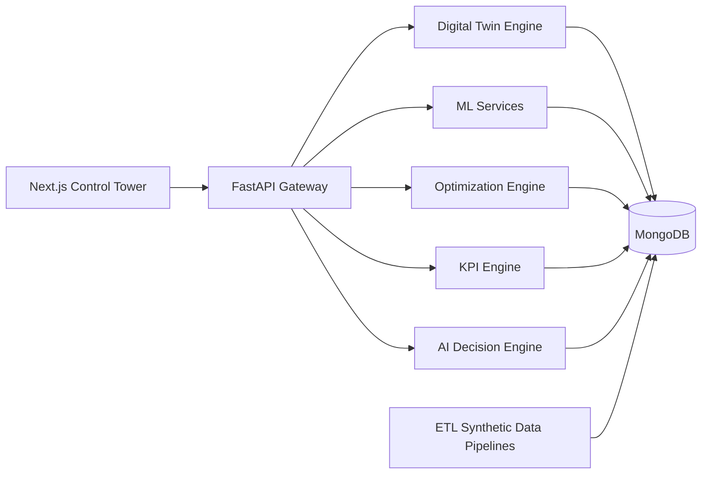
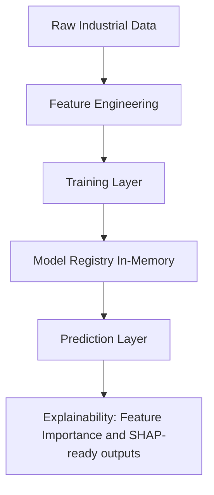
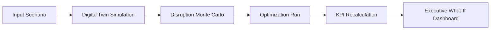

# Smart Milling AI Platform Architecture

## System architecture

```mermaid
flowchart LR
  A[Next.js Control Tower] --> B[FastAPI Gateway]
  B --> C[Digital Twin Engine]
  B --> D[ML Services]
  B --> E[Optimization Engine]
  B --> F[KPI Engine]
  B --> G[AI Decision Engine]
  C --> H[(MongoDB)]
  D --> H
  E --> H
  F --> H
  G --> H
  I[ETL Synthetic Data Pipelines] --> H
```

## ML architecture

```mermaid
flowchart TD
  A[Raw Industrial Data] --> B[Feature Engineering]
  B --> C[Training Layer]
  C --> D[Model Registry In-Memory]
  D --> E[Prediction Layer]
  E --> F[Explainability: Feature Importance and SHAP-ready outputs]
```

## Simulation flow

```mermaid
flowchart LR
  A[Input Scenario] --> B[Digital Twin Simulation]
  B --> C[Disruption Monte Carlo]
  C --> D[Optimization Run]
  D --> E[KPI Recalculation]
  E --> F[Executive What-If Dashboard]
```
